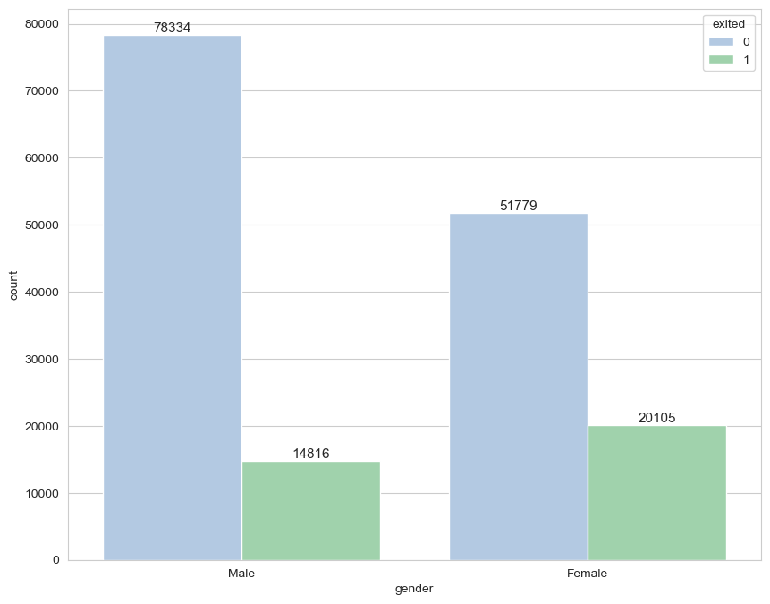
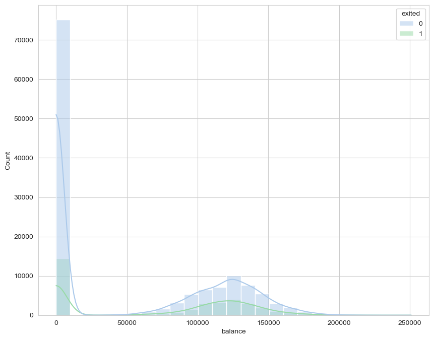

# Visualization.py 모듈 사용법

이 문서는 `visualization.py` 파일에 포함된 데이터 시각화 함수들의 사용법을 설명합니다. 이 모듈에는 `create_mosaic_plot`, `draw_countplot`, `draw_histplot` 세 가지 주요 함수가 포함되어 있습니다.

## 모듈 임포트 방법

`visualization.py` 모듈을 사용하기 전에, 먼저 해당 모듈을 임포트해야 합니다. 다음과 같이 임포트할 수 있습니다:

```python
import visualization
```

또는 특정 함수만 임포트하려면 다음과 같이 할 수 있습니다:

```python
from visualization import create_mosaic_plot, draw_countplot, draw_histplot
```

## 1. create_mosaic_plot

이 함수는 데이터 프레임 내의 두 변수 간의 관계를 모자이크 플롯으로 시각화합니다.

### 사용법

```python
visualization.create_mosaic_plot(df, col1, col2)
```

### 매개변수

- `df`: 데이터 프레임.
- `col1`: 첫 번째 열의 이름.
- `col2`: 두 번째 열의 이름.

### 예시

```python
visualization.create_mosaic_plot(df, 'geography', 'exited')
```


## 2. draw_countplot

이 함수는 카운트 플롯을 생성하여, 특정 카테고리 값의 분포를 시각화합니다.

### 사용법

```python
visualization.draw_countplot(df, x, hue, figsize=(10, 8))
```

### 매개변수

- `df`: 데이터 프레임.
- `x`: x축에 사용될 데이터 프레임의 열.
- `hue`: 데이터를 그룹화하는데 사용될 열.
- `figsize`: 그래프의 크기. 기본값은 (10, 8).

### 예시

```python
visualization.draw_countplot(df, 'gender', 'exited')
```


## 3. draw_histplot

이 함수는 히스토그램을 생성하여, 연속적인 데이터의 분포를 시각화합니다.

### 사용법

```python
visualization.draw_histplot(df, x, hue=None, figsize=(10, 8), bins=25)
```

### 매개변수

- `df`: 데이터 프레임.
- `x`: x축에 사용될 데이터 프레임의 열.
- `hue`: 데이터를 그룹화하는데 사용될 열. 기본값은 None.
- `figsize`: 그래프의 크기. 기본값은 (10, 8).
- `bins`: 히스토그램의 bin 수. 기본값은 25.

### 예시

```python
visualization.draw_histplot(df, 'balance', 'exited', bins=30)
```

---

이 문서를 참고하여 `visualization.py` 모듈의 함수들을 쉽게 사용할 수 있습니다. 필요에 따라 이 문서를 수정하거나 추가 정보를 포함시킬 수 있습니다.

